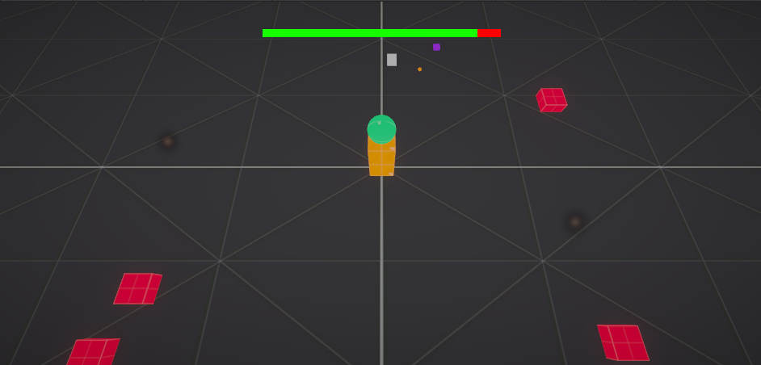

# MagicalTower
 

Three different enemy type created with different materials. Fire particle plays when hit enemy.  
Tower shake when gets hit.  
I used UniTask for coroutines to be more efficient.
